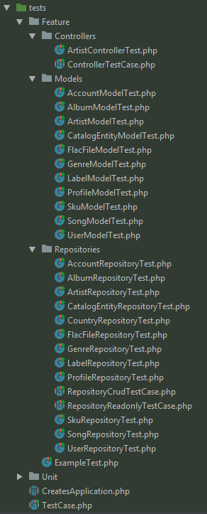

# Testing with PHPUnit

## Directory Structure
 
 The below image should give you a good idea how our tests are organized. Mostly you see Feature 
 tests here!
 
 
 
## Run all tests
 * Run the following command from the project root directory:
```
vendor/bin/phpunit
```

## Run all tests in a specific `directory`
 * `PATH/TO/DIRECTORY` - Full path to the directory relative to the project root
 ***Note: don't include `.php` in the path***
```
vendor/bin/phpunit PATH/TO/DIRECTORY 
```

## Run a single test `class`
 * `CLASSNAME` - The name of the class of which your method is in
 * `PATH/TO/FILE` - Full path to the file itself relative to the project root
 ***Note: don't include `.php` in the path***
```
vendor/bin/phpunit --filter CLASSNAME PATH/TO/FILE 
```

## Run a single test `method`
 * `METHODNAME` - The name of the method you wish to test
 * `CLASSNAME` - The name of the class of which your method is in
 * `PATH/TO/FILE` - Full path to the file itself relative to the project root
 ***Note: don't include `.php` in the path***
``` 
vendor/bin/phpunit --filter METHODNAME CLASSNAME PATH/TO/FILE
```

## Dealing with cache
Often times you will have to test `Model Repositories` that normally would fetch data from the 
database. This is fine until the repository implements a caching layer in which you will get
inaccurate test results.

To avoid this we suggest during all `CUD` (Create Update Delete) operations that you use the 
`->fresh()` method on the `Model` instance.

***Example***

In this example we are updating the resource in the database, then we need to validate the 
persistence of the data so we ***MUST*** fetch a `fresh` result from the database, otherwise this
test could be compromised if it returns a cached result.
 
```php

public function test_method_update_updatesResource()
{
    $artist = factory($this->artist->class())->create();

    $profile = factory($this->repo->class())->create([
        'profilable_id' => $artist->id,
        'profilable_type' => $this->repo->class(),
    ]);

    $newValue = 'Foo Bar';

    $property = 'moniker';

    $profile = $this->repo->update($profile->id, [
        $property => $newValue,
    ]);

    $this->assertTrue(
        $profile->fresh()->{$property} === $newValue
    );
}
```

## PHPCS Linting
We use [GrumPHP](https://github.com/phpro/grumphp/blob/master/README.md) as a task runner which will simply run the 
`phpcs` for php linting.

***Note: Be sure to run [phpunit](#phpunit-run-all-tests) tests after fixing linting issues!***

**Running GrumPHP**
```
vendor/bin/grumphp run
```

**Running Php Code Sniffer**
 * `FILEPATH` - The full path to the directory or file you wish to check relative to the project root
 
 *Note: You can specify more than one FILEPATH separated with a SPACE*
```
vendor/bin/phpcs --standard=PSR2 FILEPATH
```

**Fixing linting errors automatically**
 * `FILEPATH` - The full path to the directory or file you wish to check relative to the project root
 
 *Note: You can specify more than one FILEPATH separated with a SPACE*
```
vendor/bin/phpcbf --standard=PSR2 FILEPATH 
```

## `Unit Test` vs `Feature Test`
 
 This is the way we like to interpret it:
 
 * ***`Unit Test`*** - testing an individual unit, such as a method (function) in a class, with all 
 dependencies mocked up.
 
 * ***`Feature (aka Functional/Integration) Test`*** - testing a slice of functionality in a system. 
 This will test many methods and may interact with dependencies like Databases or Web Services.
 
## Feature Test Example
 
 ```php
/**
* Ensure the method create() creates a new record in the database and creates a profile for
* said Artist.
*
* @return void
*/
public function test_method_create_storesNewModel()
{
    $profile = factory($this->profile->class())->make()->toArray();
    
    $artist = $this->repo->create($profile);
    
    $this->assertInstanceOf($this->repo->class(), $artist);
    $this->assertInstanceOf($this->profile->class(), $artist->profile);
}
 ```
 
## Unit Test Example
 
 *This is just a crude example and not related to this project. At the time of this writing we do not
  have a example of a Unit test in this project.*
  
 ```php
 public function testDivideByZero() {
    $calcMock=$this->getMock('\Calculator',array('getNumberFromUserInput'));
    $calcMock->expects($this->never())
        ->method('getNumberFromUserInput')
        ->will($this->returnValue(10));
    $this->assertEquals(NAN, $calcMock->divideBy(0));
}
 ```