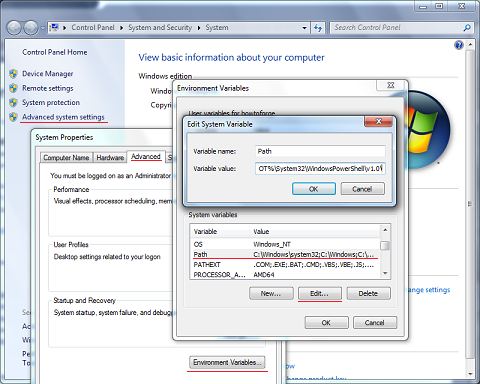
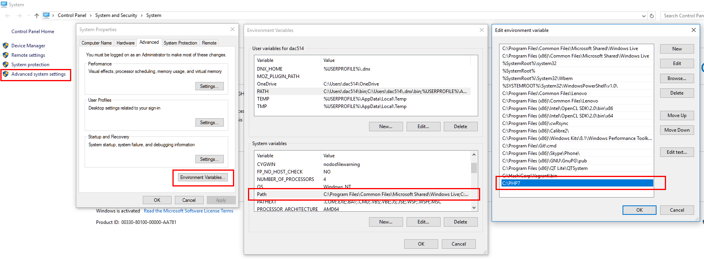

# Intro
We will try and help you get setup on `Windows 7 or Windows 10` to start contributing to the `web-api` repository!

## Prerequisite

* Windows 7 or Windows 10
* Internet Connection
* Patience

## Git Bash Terminal
Git Bash is a great way to simulate a bash environment while on windows making web development easier.

Git Bash is included in the [Git For Windows](https://github.com/git-for-windows/git/releases) Installer.

* Download and install the latest version

*[Git For Windows Website](https://gitforwindows.org/)*

*At this point, You may want to open up `Git Bash` terminal as we will be using it throughout this documentation.*

## PHP 7.2
This will help setup a common PHP installation on windows. 

*This setup is not specific to our project and should be good for most projects.*

* Download the latest PHP7 (non-thread safe version) zip file from [HERE](http://windows.php.net/)

* Extract the contents of the zip file into `C:\PHP7`

* Copy `C:\PHP7\php.ini-development` to `C:\PHP7\php.ini`

* Open the newly copied `C:\PHP7\php.ini` in a text editor like 
[Notepad++](https://notepad-plus-plus.org/repository/7.x/7.5.8/npp.7.5.8.Installer.x64.exe).

* Scroll down to `“Directory in which the loadable extensions (modules) reside.”` 
and uncomment: `extension_dir = “ext”`

*Should look like:*
```ini
; Directory in which the loadable extensions (modules) reside.
; http://php.net/extension-dir
; extension_dir = "./"
; On windows:
extension_dir = "ext"
```

* Scroll down to the `Dynamic Extensions` section and uncomment the following extensions:

```ini
extension=bz2
extension=curl
extension=fileinfo
extension=gd2
extension=gettext
extension=gmp
extension=intl
extension=imap
extension=ldap
extension=mbstring
extension=exif
extension=mysqli
extension=odbc
extension=openssl
extension=pdo_mysql
extension=pdo_odbc
extension=pdo_pgsql
extension=pdo_sqlite
extension=pgsql
extension=shmop
extension=soap
extension=sockets
extension=sqlite3
extension=tidy
extension=xmlrpc
extension=xsl
```
* Add `C:\PHP7` to the Windows system path environment variable.

*Windows 7*



***Important: on windows 7 you must add to the paths `value` ... the values are separated with a `;`***

*Windows 10*



* Finally, In [Git Bash](#git-bash-terminal) test that the installation is successful by typing `php -v`

*Should see something similar to:*
```
PHP <version>  (cli) (built: <date time>)
...
```

## Composer
This is the easiest way to get `Composer` set up on your machine.

Download and run [Composer-Setup.exe](https://getcomposer.org/Composer-Setup.exe). It will install the latest Composer 
version and set up your PATH so that you can call composer from any directory in your command line.

## VirtualBox
Download and install [VirtualBox](https://download.virtualbox.org/virtualbox/5.2.18/VirtualBox-5.2.18-124319-Win.exe)

## Vagrant
Download and install [Vagrant](https://releases.hashicorp.com/vagrant/2.1.5/vagrant_2.1.5_x86_64.msi)

## Hosts File
On windows this can be a bit tricky.

*We are using the domain `api.indiehd.site`, note the `.site` ...*

*Windows 10*

* Press the Windows key
* Type `notepad` in the search field
* In the search results, `right-click Notepad` and `select Run as administrator`
* From Notepad, `open` the following file: `C:\Windows\System32\Drivers\etc\hosts`
* Add `192.168.10.10    api.indiehd.site` to the file
* Click `File -> Save` to save your changes

*Windows 7*

* Click `Start -> All Programs -> Accessories`
* `Right-click Notepad` and `select Run as administrator`
* `Click Continue` on the needs your permission window
* When Notepad opens, `click File -> Open`
* In the `File name field`, type `C:\Windows\System32\Drivers\etc\hosts`, Click Open
* Add `192.168.10.10    api.indiehd.site` to the file
* Click `File -> Save` to save your changes

## Directory Structure
*Open up [Git Bash](#git-bash-terminal). It will be used to run all commands used in this section*

This will help keep your web projects organized.

* Run these two commands:
```
mkdir ~/projects
mkdir ~/projects/www 
```

## Cloning
[web-api](https://github.com/indiehd/web-api)

*Open up [Git Bash](#git-bash-terminal). It will be used to run all commands used in this section*

* Run `cd ~/projects/www && https://github.com/indiehd/web-api.git`

## Project Dependencies

*Open up [Git Bash](#git-bash-terminal). It will be used to run all commands used in this section*

* Run `cd ~/projects/www/web-api`
* Run `php artisan key:generate`
* Run `composer install`

## Homestead

*Open up [Git Bash](#git-bash-terminal). It will be used to run all commands used in this section*

**Add the vagrant box**

* Run `vagrant box add laravel/homestead`
 
**Installing** 

* Run `git clone https://github.com/laravel/homestead.git ~/Homestead`
* Run `cd ~/Homestead && git checkout v7.17.0`
* Run `bash init.sh` *(If this fails try executing the `init.bat` in that directory)*
 
**Configuring** 

* Open the `Homestead.yaml` file in the `~/Homestead` directory

*Please note we are working with `Yaml`, which is very picky regarding `tabs vs spaces`. 
Opening this file in `Notepad++` and selecting `Yaml` under the Language menu will help 
highlight issues.*

* **The first thing we need to configure here is the `folders` section**
    ```yaml
    folders:
        - map: "C:\Users\<YOUR USERNAME>\projects"
          to: /home/vagrant/projects
    ```
    *Now all your projects can be accessed from with in the vagrant vm*

* **Next we will setup our site to be served by homestead**
    *We are using the domain `api.indiehd.site` that we setup in the [Hosts File](#hosts-file)*
    ```yaml
    sites:
        - map: api.indiehd.site
          to: /home/vagrant/projects/www/web-api/public
    ```
    *Make note of the `/public` directory*

* **Next we need to setup a couple databases**
    ```yaml
    databases:
        - homestead
        - indiehd
        - indiehd_test
    ```
    
**Thats It! Save this file and exit ..**

## Finishing Up & Testing

*Open up [Git Bash](#git-bash-terminal). It will be used to run all commands used in this section*

Before we check to make sure that everything it working correctly we need to run a few 
commands to get the project setup.

* Run `vagrant up` 
    
    *Be sure there are no errors here. They will be highlighed in red. You may also see a bunch of warnings like 
    below that can be ignored assuming it eventually finishes*
    ```
    homestead-7: Warning: Connection reset. Retrying...
    homestead-7: Warning: Remote connection disconnect. Retrying... 
    ```
    
* Confirm the site is accessible via `http://api.indie.site`
    
    *You should see a page of some sort that will indicate that its working*
    
* Run `vagrant ssh`

    *This will log you into the vm via ssh as `vagrant` user. You should end up at a prompt like below.*
    ```
     vagrant@homestead:~$ 
    ```

*You are not working inside the Virtual Machine (Ubuntu)*
    
* Run `cd projects/www/web-api`
* Run `php artisan migrate --seed`
    
*This will seed a bunch of dummy data into the database, this is useful during development*

**Thats It!!** 

Having issues please join [our discord server](https://discord.gg/hDC3Yw6) and Join `#general` and ask for help.
